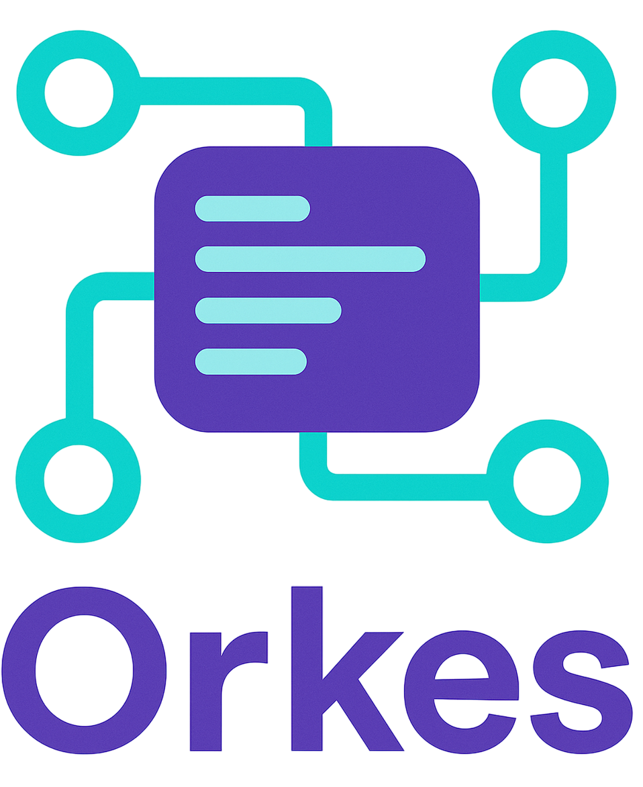

<h2 align="center">
  <br/>
  No abstractions. No black boxes. Just your Agent
</h2>


## 🔍 What is Orkes?

**Orkes** helps you coordinate LLM agents using plain Python, emphasizing **explicit control flow**, **transparent agent logic**, and **simple message passing**.

## 📝 Background

A while back, I was tasked with ensuring that our agentic-based streaming calls closed properly when a client disconnected.

Out of the box, there wasn’t a straightforward way to close the underlying HTTP connection. Why does this matter?

Because in our case, leaving connections hanging was detrimental to keeping our self-hosted LLM stable and reliable.

The frustrating part: today’s higher level libraries are abstractions on top of abstractions, hidden under even more abstractions, and at the end hidden in dependencies abstraction, layered until a simple fix turns into a complete clusterfuck.

Hence the pain of using high-level abstraction frameworks, some niche cases just don’t get covered.

## 📚 Documentation

* [orkes.agents](orkes/agents/docs.md) – Documentation for agent classes, interfaces, and tool integration.
* [orkes.graph](orkes/graph/docs.md) – Guides for building, compiling, and running DCG-based workflows with OrkesGraph.
* [orkes.services](orkes/services/docs.md) – Details on LLM connections, prompt handling, and response parsing services.

## 🔹 Core Principles

* **Explicit control flow** — use DCGs, FSMs, or plain loops
* **Transparent agents** — define prompt, tool, and logic directly
* **Simple message passing** — plain dicts, no graph state magic
* **Minimal dependencies** — only what you truly need
* **100% Pythonic** — easy to read, modify, and extend
* **Stateless by default** — you control memory and state
* **Hackable and debuggable** — nothing hidden

## 🧪 Testing

The `tests/` directory contains various testing components to ensure the reliability and functionality of Orkes:

*   **`tests/mock_servers/`**: Houses mock LLM servers that mimic the behavior of popular LLM providers like OpenAI (which also covers vLLM), Google Gemini, and Anthropic Claude. These mocks support both standard request/response and streaming interactions, enabling consistent testing without external API calls.
*   **`tests/integration_test/`**: Contains integration tests that verify the `orkes.services.connections` module's ability to interface correctly with different LLM providers using the mock servers.
*   **`tests/examples/`**: Provides runnable examples of how to use various Orkes components.

To run all integration and example tests, use the provided script:

```bash
python tests/run_all_tests.py
```

## 🛠️ Project Status

This is the initial stage of Orkes.

* [x] Vision and core philosophy
* [x] Elementary Directed Cyclic Graph orchestration engine
* [x] Controllable Agent structure (prompt + tool + fn)
* [x] **LLM connection abstractions (OpenAI/vLLM, Gemini, Claude) with synchronous and asynchronous streaming support**
* [x] Minimal examples
* [x] Documentations

## License

This poject is available as open source under the terms of the [MIT License](https://github.com/hfahrudin/orkes/blob/main/LICENSE).