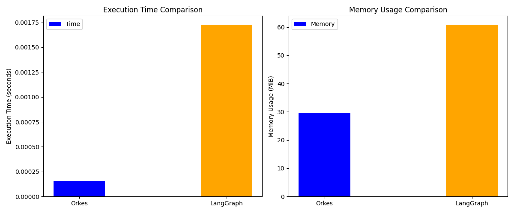
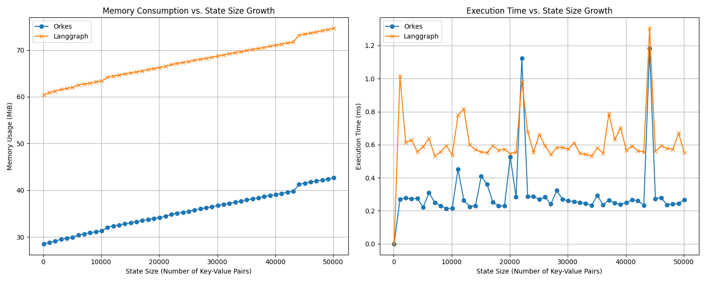

.. _benchmark:

==========
Benchmarks
==========

This guide details the benchmarks available for Orkes and how to run them, providing insights into performance and resource usage compared to other frameworks.

Basic Performance
-----------------

This benchmark compares the fundamental execution time and memory consumption of Orkes and LangGraph for a basic graph traversal scenario. It provides a quick overview of the overhead associated with each framework.

**How to Run:**

To execute this benchmark, navigate to the project's root directory and run the `run_all_benchmarks.py` script, which will orchestrate all available benchmarks:

.. code-block:: bash

    python tests/benchmarks/run_all_benchmarks.py

Alternatively, to run only the basic performance benchmark, you can execute its dedicated runner script:

.. code-block:: bash

    python tests/benchmarks/basic_benchmark/runner.py

**Expected Results:**

The script will output execution time and memory usage for both Orkes and LangGraph.

*Example Output (values may vary):*

**Conclusion:**

Based on the basic performance benchmark, Orkes generally demonstrates lower execution time and memory consumption for fundamental graph operations compared to LangGraph. This suggests a more lightweight and efficient core for basic use cases.

State Bloat
-----------

This benchmark investigates how memory consumption and execution time evolve as the state managed by the graph frameworks grows over multiple iterations. It is crucial for understanding the scalability and efficiency of each framework under increasing data loads.

**How to Run:**

To execute this benchmark, the `run_all_benchmarks.py` script will automatically include it:

.. code-block:: bash

    python tests/benchmarks/run_all_benchmarks.py

To run only the state bloat benchmark, you can execute its dedicated runner script:

.. code-block:: bash

    python tests/benchmarks/statebloat_benchmark/runner.py

**Expected Results:**

This plot illustrates the memory and execution time trends for both Orkes and LangGraph as the state size increases.

*Example Output (values may vary):*

**Conclusion:**

The state bloat benchmark provides valuable insights into how each framework handles increasing state complexity. The generated plots visualize the scaling behavior of memory usage and execution time, indicating which framework is more efficient in managing large and evolving graph states. Users can analyze these trends to determine the most suitable framework for applications with significant state growth.