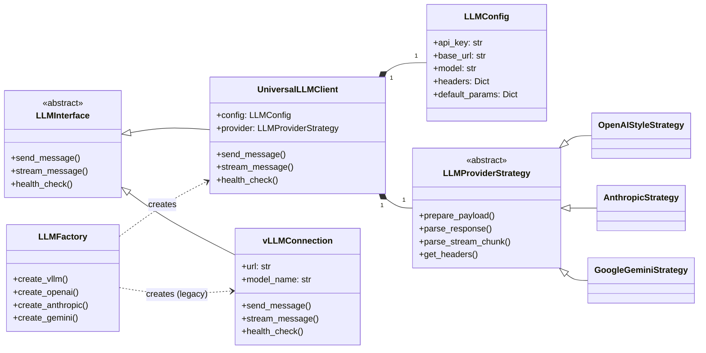

# orkes.services

This documentation covers the three foundational components of the **LLM Core Layer**:

1. **Prompt Handler** — for structured prompt generation
2. **LLM Connection** — for model API communication
3. **Response Parser** — for handling streamed or batched outputs

Together, they form the base for building **LLM-driven agent pipelines** or **custom orchestration frameworks**.

## Table of Contents
1. [Architecture Overview](#architecture-overview)
2. [Prompt Handler](#prompt-handler)
3. [LLM Connection](#llm-connection)
    * [Overview](#overview-1)
    * [Class Diagram](#class-diagram-1)
    * [LLMConfig](#llmconfig)
    * [LLMProviderStrategy](#llmproviderstrategy)
    * [UniversalLLMClient](#universalllmclient)
    * [LLMFactory](#llmfactory)
4. [Response Parser](#response-parser)
5. [Usage Example](#usage-example)
6. [Future Extensions](#future-extensions)


## Architecture Overview

The `LLM Connection` layer in Orkes provides two primary abstractions for interacting with Large Language Models (LLMs):

1.  **`vLLMConnection` (Legacy)**: A specific implementation designed for direct integration with vLLM (OpenAI-compatible) servers. It offers basic synchronous and asynchronous communication.
2.  **`UniversalLLMClient` (Modern & Extensible)**: A more flexible, strategy-pattern-based client that unifies interaction with various LLM providers, including OpenAI-compatible services, Google Gemini, and Anthropic Claude. It abstracts away provider-specific details, allowing for seamless switching between models and easy extension to new providers.

This architecture enables:

*   **Unified API Interaction**: Use a single client to communicate with multiple LLM providers.
*   **Synchronous and Asynchronous Operations**: Supports both `send_message` (for full responses) and `stream_message` (for incremental token streaming).
*   **Extensibility**: Easily add support for new LLM providers by implementing new `LLMProviderStrategy` classes.
*   **Configurable Parameters**: Control generation parameters (e.g., temperature, max_tokens) on a per-request basis.
*   **Health Checks**: Monitor the availability of LLM services.

### Class Diagram



### `LLMConfig`

A universal configuration object that holds essential parameters for any LLM connection.

| Parameter        | Type                       | Description                                         |
| :--------------- | :------------------------- | :-------------------------------------------------- |
| `api_key`        | `str`                      | API key for authentication with the LLM provider.   |
| `base_url`       | `str`                      | Base URL of the LLM service endpoint.               |
| `model`          | `str`                      | Identifier of the specific LLM model to use.        |
| `extra_headers`  | `Optional[Dict[str, str]]` | Optional: Additional HTTP headers for requests.     |
| `default_params` | `Optional[Dict[str, Any]]` | Optional: Default generation parameters (e.g., temperature, max_tokens). |

### `LLMProviderStrategy` (ABC)

An abstract base class that defines the interface for provider-specific logic. Concrete implementations of this strategy handle the unique payload structures, response parsing, and authentication headers for different LLM providers.

**Key Responsibilities:**

*   **`prepare_payload`**: Converts a standardized message format into the provider-specific JSON payload required by the LLM API.
*   **`parse_response`**: Extracts the generated text content from a non-streaming API response.
*   **`parse_stream_chunk`**: Parses individual chunks from a streaming API response to extract incremental text.
*   **`get_headers`**: Provides the necessary authentication and content headers for the provider's API.

**Concrete Implementations:**

*   **`OpenAIStyleStrategy`**: For OpenAI, vLLM, and other OpenAI-compatible APIs.
*   **`AnthropicStrategy`**: For Anthropic\'s Claude API.
*   **`GoogleGeminiStrategy`**: For Google\'s Gemini API.

### `UniversalLLMClient`

The core client that utilizes an `LLMConfig` and an `LLMProviderStrategy` to interact with any configured LLM. It exposes a consistent API regardless of the underlying LLM provider.

| Method                                                                   | Description                                                          |
| :----------------------------------------------------------------------- | :------------------------------------------------------------------- |
| `send_message(messages: List[Dict[str, str]], endpoint: str = None, **kwargs)` | Sends a synchronous request to the LLM and returns the full response. |
| `stream_message(messages: List[Dict[str, str]], endpoint: str = None, **kwargs)` | Sends a request and asynchronously streams incremental text chunks from the LLM. |
| `health_check(endpoint: str = "/health")`                                | Performs a health check on the LLM service.                           |

### `LLMFactory`

A static factory class for conveniently creating configured instances of `UniversalLLMClient` for various supported LLM providers.

| Method                                                          | Description                                            |
| :-------------------------------------------------------------- | :----------------------------------------------------- |
| `create_vllm(url: str, model: str, api_key: str = "EMPTY", base_url: str = None)` | Creates a client for a vLLM (OpenAI-compatible) service. |
| `create_openai(api_key: str, model: str = "gpt-4", base_url: str = "https://api.openai.com/v1")` | Creates a client for OpenAI models.                    |
| `create_anthropic(api_key: str, model: str = "claude-3-opus-20240229", base_url: str = "https://api.anthropic.com/v1")` | Creates a client for Anthropic Claude models.          |
| `create_gemini(api_key: str, model: str = "gemini-pro", base_url: str = "https://generativelanguage.googleapis.com/v1beta")` | Creates a client for Google Gemini models.             |

## 📤 Response Parser

### Overview

Handles **streamed** and **non-streamed** model responses using flexible parser interfaces.
<!-- 
---

### Class Diagram

```mermaid
classDiagram
    direction LR

    class LLMInterface{
        <<abstract>>
        +send_message()
        +stream_message()
        +health_check()
    }

    class LLMConfig {
        +api_key: str
        +base_url: str
        +model: str
        +headers: Dict
        +default_params: Dict
    }

    class LLMProviderStrategy {
        <<abstract>>
        +prepare_payload()
        +parse_response()
        +parse_stream_chunk()
        +get_headers()
    }

    class OpenAIStyleStrategy
    class AnthropicStrategy
    class GoogleGeminiStrategy

    LLMProviderStrategy <|-- OpenAIStyleStrategy
    LLMProviderStrategy <|-- AnthropicStrategy
    LLMProviderStrategy <|-- GoogleGeminiStrategy

    class UniversalLLMClient {
        +config: LLMConfig
        +provider: LLMProviderStrategy
        +send_message()
        +stream_message()
        +health_check()
    }
    LLMInterface <|-- UniversalLLMClient
    UniversalLLMClient "1" *-- "1" LLMConfig
    UniversalLLMClient "1" *-- "1" LLMProviderStrategy

    class vLLMConnection {
        +url: str
        +model_name: str
        +send_message()
        +stream_message()
        +health_check()
    }
    LLMInterface <|-- vLLMConnection

    class LLMFactory {
        +create_vllm()
        +create_openai()
        +create_anthropic()
        +create_gemini()
    }

    LLMFactory ..> UniversalLLMClient : creates
    LLMFactory ..> vLLMConnection : creates (legacy)
``` -->

---

### `ResponseInterface`

Defines the parsing contract.

| Method                         | Description                             |
| ------------------------------ | --------------------------------------- |
| `parse_stream_response(chunk)` | Parse incremental streaming data        |
| `parse_full_response(payload)` | Parse entire payloads                   |
| `_generate_event(buffer)`      | Format buffered data into event strings |

---

### `ChatResponse`

Concrete implementation for **chat-style responses** (e.g. OpenAI/vLLM).

| Parameter   | Type  | Default   | Description             |
| ----------- | ----- | --------- | ----------------------- |
| `end_token` | `str` | `"<EOT>"` | Marks stream completion |

**Behavior:**

* Detects `[DONE]` or `end_token`
* Optionally returns **SSE** formatted events
* Graceful handling of malformed chunks

---


### `StreamResponseBuffer`

Buffers streaming responses and yields formatted chunks.

| Method                                   | Description                          |
| ---------------------------------------- | ------------------------------------ |
| `async stream(response, buffer_size=10)` | Yields parsed events as data arrives |
| `_is_buffer_full(buffer, size)`          | Determines when to flush buffer      |

**Example:**

```python
response = requests.get(url, stream=True)
parser = ChatResponse()
buffer = StreamResponseBuffer(parser)

async for event in buffer.stream(response):
    print(event)
```

---

## Usage Example

```python
import asyncio
from orkes.services.connections import LLMFactory
from orkes.services.prompts import ChatPromptHandler
from orkes.services.responses import ChatResponse

async def main():
    # 1. Prepare messages using Prompt Handler
    handler = ChatPromptHandler(
        system_prompt_template="{persona}.",
        user_prompt_template="{input}"
    )
    queries = {
        "system": {"persona": "You are a creative assistant."},
        "user": {"input": "Write a short haiku about autumn."}
    }
    messages = handler.gen_messages(queries)

    # 2. Configure and use LLM Clients from LLMFactory

    # --- OpenAI-compatible (e.g., vLLM or OpenAI) ---
    print("\n--- OpenAI/vLLM Sync Response ---")
    openai_client = LLMFactory.create_openai(
        api_key="sk-...", # Replace with your actual OpenAI API key or "EMPTY" for vLLM
        model="gpt-4o",
        base_url="http://localhost:8000/v1" # Use mock server URL
    )
    try:
        response_data = openai_client.send_message(messages)
        print(response_data['content'])
    except Exception as e:
        print(f"OpenAI/vLLM sync connection failed: {e}")

    print("\n--- OpenAI/vLLM Stream Response ---")
    try:
        stream_parser = ChatResponse()
        async for chunk in openai_client.stream_message(messages):
            # parse_stream_chunk needs to be implemented in ChatResponse
            # For direct stream, you might process chunk raw or via helper
            print(chunk, end="", flush=True)
        print() # Newline after stream
    except Exception as e:
        print(f"OpenAI/vLLM stream connection failed: {e}")


    # --- Google Gemini ---
    print("\n--- Google Gemini Sync Response ---")
    gemini_client = LLMFactory.create_gemini(
        api_key="YOUR_GEMINI_API_KEY", # Replace with your actual Gemini API key
        model="gemini-pro",
        base_url="http://localhost:8000/v1beta" # Use mock server URL
    )
    try:
        response_data = gemini_client.send_message(messages)
        print(response_data['content'])
    except Exception as e:
        print(f"Google Gemini sync connection failed: {e}")
    
    print("\n--- Google Gemini Stream Response ---")
    try:
        async for chunk in gemini_client.stream_message(messages):
            print(chunk, end="", flush=True)
        print() # Newline after stream
    except Exception as e:
        print(f"Google Gemini stream connection failed: {e}")

    # --- Anthropic Claude ---
    print("\n--- Anthropic Claude Sync Response ---")
    claude_client = LLMFactory.create_anthropic(
        api_key="YOUR_ANTHROPIC_API_KEY", # Replace with your actual Anthropic API key
        model="claude-3-opus-20240229",
        base_url="http://localhost:8000/v1" # Use mock server URL
    )
    try:
        response_data = claude_client.send_message(messages)
        print(response_data['content'])
    except Exception as e:
        print(f"Anthropic Claude sync connection failed: {e}")

    print("\n--- Anthropic Claude Stream Response ---")
    try:
        async for chunk in claude_client.stream_message(messages):
            print(chunk, end="", flush=True)
        print() # Newline after stream
    except Exception as e:
        print(f"Anthropic Claude stream connection failed: {e}")


if __name__ == "__main__":
    asyncio.run(main())

```

## Future Extensions

| Feature             | Description                                          |
| ------------------- | ---------------------------------------------------- |
| Tool prompts        | Extend `PromptHandler` to include function calling contexts |
| Async HTTP          | Replace `requests` with `aiohttp` in `vLLMConnection`        |
| Unified errors      | Add standard error objects for failed responses              |
| Advanced buffering  | Sentence-aware or token-based stream flush           |
| Template validation | Validate placeholders on initialization                      |
| Multi-turn chaining | Stateful prompt evolution across turns                   |